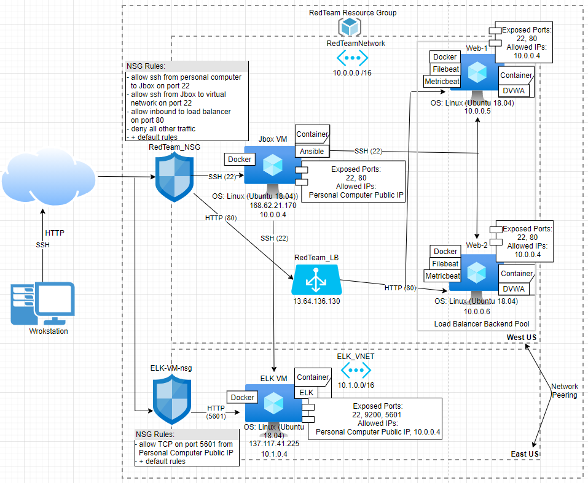
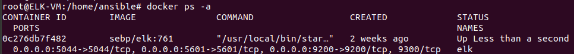
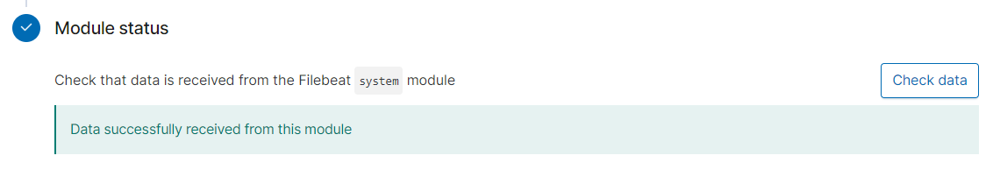
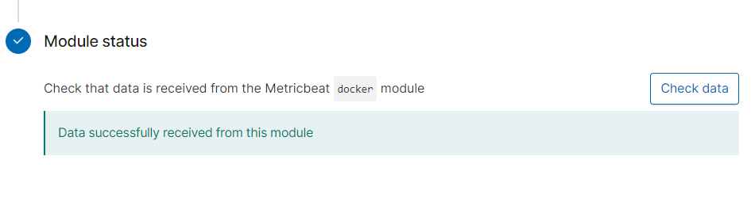

## :large_blue_circle: Automated ELK Stack Deployment

The files in this repository were used to configure the network depicted in the diagram below. :arrow_down:

These files have been tested and used to generate a live ELK deployment on Azure. They can be used to either recreate the entire deployment pictured above. Alternatively, select portions of the playbook (.yml) file may be used to install only certain pieces of it, such as Filebeat.

  - [install-elk.yml](https://github.com/rachelamandamartin/Project1/blob/main/Files/install-elk.yml)
  - [install-filebeat.yml](https://github.com/rachelamandamartin/Project1/blob/main/Files/filebeat.yml.txt)
  - [install-metricbeat.yml](https://github.com/rachelamandamartin/Project1/blob/main/Files/metricbeat.yml.txt)
  - [install-DVWA.yml](https://github.com/rachelamandamartin/Project1/blob/main/Files/dvwa.yml.txt)

This document contains the following details:
- Description of the Topology
- Access Policies
- ELK Configuration
  - Beats in Use
  - Machines Being Monitored
- How to Use the Ansible Build

### :large_blue_circle: Description of the Topology

The main purpose of this network is to expose a load-balanced and monitored instance of DVWA, the D*mn Vulnerable Web Application.

Load balancing ensures that the application will be highly **reliable**, in addition to restricting **traffic** to the network.
- The load balancer helps to maintain the systems availability by ensuring the servers are not overwhelmed with requests.  
- It uses its off-loading function to defend an organization against distributed denial-of-service (DDoS) attacks.

The advantage of a Jump Box
- The jump box serves as a secure gateway to connect to other servers within the network. 
- It also serves as an origin point for deploying updates on multiple servers. 

Integrating an ELK server allows users to easily monitor the vulnerable VMs for changes to the **system logs** and **system metrics**.
- Installed as an agent on your servers, **Filebeat** monitors the log files, collects log events, and forwards them either to Elasticsearch or Logstash for indexing. 
- **Metricbeat** periodically collects metrics from the operating system and services running on the server and forwards them to Elasticsearch, Logstash, or to another specified output.

The configuration details of each machine may be found below.

| Name       | Function         | IP Address | Operating System |
|------------|------------------|------------|------------------|
| Jump Box   | Gateway          | 10.0.0.4   | Linux            |
| Web-1      | Server           | 10.0.0.5   | Linux            |
| Web-2      | Server           | 10.0.0.6   | Linux            |
| ELK-VM     | Server/Monitoring| 10.1.0.4   | Linux            |

### :large_blue_circle: Access Policies

The machines on the internal network are not exposed to the public Internet. 

Only the **Jump Box** machine can accept connections from the Internet. Access to this machine is only allowed from the following IP addresses:
- Personal Computer Public IP (whitelisted IP address)

Machines within the network can only be accessed by the **Jump Box** machine.
- Jump Box Private IP: 10.0.0.4 (allowed access to the ELM-VM)

A summary of the access policies in place can be found in the table below.

| Name          | Publicly Accessible | Allowed IP Addresses                 |
|---------------|---------------------|--------------------------------------|
| Jump Box      | Yes                 | Personal Computer Public IP          |
| Web-1         | No                  | 10.0.0.4                             |
| Web-2         | No                  | 10.0.0.4                             |
| ELK-VM        | Yes                 | Pesonal Computer Public IP, 10.0.0.4 |
| Load Balancer | Yes                 | Personal Computer Public IP          |

### :large_blue_circle: Elk Configuration

Ansible was used to automate configuration of the ELK machine. No configuration was performed manually, which is advantageous because...
- System installations and updates can be deployed more easily, and processes become more replicable.
 

The playbook implements the following tasks:
- Install docker.io
- Install python pip3
- Install Docker Python Module 
- Increase virtual memory 
- Download and launch a docker elk container

The following screenshot displays the result of running `docker ps -a` after successfully configuring the ELK instance.

### :large_blue_circle: Target Machines & Beats
This ELK server is configured to monitor the following machines:
- Web-1: 10.0.0.5
- Web-2: 10.0.0.6

We have installed the following Beats on these machines:
- Filebeat & Metricbeat

These Beats allow us to collect the following information from each machine:
- **Filebeat**
  - **Type of data collected:** Designed to ship log files 
  - **Example:** For instance, you can track login attempts from unique visitors using filebeat 
- **Metricbeat**
  - **Type of data collected:** Designed to ship host metrics 
  - **Example:** For instance, you can track memory usage using metricbeat

### :large_blue_circle: Using the Playbook
In order to use the playbook, you will need to have an Ansible control node already configured. Assuming you have such a control node provisioned: 

SSH into the control node and follow the steps below:

**For Filebeat:**
- Copy the filebeat-config.yml file to /etc/ansible/files directory in the anisble container
- Update the filebeat-config.yml file to include...
  - At line **#1106** replace the IP address with the IP address of your ELK machine:
    - `hosts: ["10.1.0.4:9200"]`
    - `username: "elastic"`
    - `password: "changeme"`
  - At line **#1806** replace the IP address with the IP address of your ELK machine: 
    - `host: "10.1.0.4:5601"`  
- Run the filebeat playbook you created, and navigate to the filebeat installation page on the ELK server GUI to check that the installation worked as expected.
  - Scroll to Step 5: Module Status on this page and click **Check Data**
  - If successfully deployed the check box should appear like this: 

**For Metricbeat:**
- Copy the metricbeat-config.yml file to /etc/ansible/files directory in the ansible container
- Update the metricbeat-config.yml file to include...
  - At line **#62** replace the IP address with the IP address of your ELK machine:
    - `host: "10.1.0.4:5601"`
  - At line **#96** replace the IP address with the IP address of your ELK machine:
    - `hosts: ["10.1.0.4:9200"]`
- Run the metricbeat playbook you created and navigate to the metricbeat installation (docker metrics) page on the ELK server GUI to check that the installation worked as expected.
  - Scroll to Step 5: Module Status on this page and click **Check Data**
  - If successfully deployed the check box should appear like this: 

_Answer the following questions to fill in the blanks:_
- _Which file is the playbook? Where do you copy it?_
  - The playbook files are filebeat.yml, metricbeat.yml, install-elk.yml, and dvwa.yml
    - Playbook files should all be within the /etc/ansible directory in the ansible container
    - It should also be noted that the configuration files for filebeat (filebeat-config.yml) and metricbeat (metricbeat-config.yml) should be copied onto the Web VM's in /etc/filebeat (for filebeat) and /etc/metricbeat (for metricbeat) 
- _Which file do you update to make Ansible run the playbook on a specific machine? How do I specify which machine to install the ELK server on versus which to install Filebeat on?_
  - In order to make Ansible run the playbook on a specific machine you must update the **hosts** file on the ansible container in the /etc/ansible directory to include groups labeled webservers and elk 
    - The webservers group includes Web-1 and Web-2 private IP's as well as the specified interpreter (python3), and the elk group includes the ELK-VM private IP and specified interpreter (python3).
    - They are listed in the hosts file like this: 
      - `[webservers]`
        `10.0.0.5 ansible_python_interpreter=/usr/bin/python3`
        `10.0.0.6 ansible_python_interpreter=/usr/bin/python3`
      
        `[elk]`
        `10.1.0.4 ansible_python_interpreter=/usr/bin/python3`
    - When you are creating the playbook be sure to specify at the top of the playbook which group you would like the playbook to be executed on 
    - If you want to execute the playbook on the Webservers (Web-1 & 2) your playbook should include "hosts: webservers", while if you want to execute the playbook on the ELK-VM your playbook file should include "hosts: elk"
    - More specifically the ELK server was installed on the elk hosts, while filebeat and metricbeat were installed on the webservers hosts 
- _Which URL do you navigate to in order to check that the ELK server is running?_ 
  - To ensure the ELK server is running navigate to http://137.117.41.225:5601/app/kibana 
    - Note: the IP address used in this link is the ELK-VM public IP 

**Files Mentioned that were not Previously Listed**
  - [hosts](https://github.com/rachelamandamartin/Project1/blob/main/Files/hosts.txt)
  - [filebeat-config.yml](https://github.com/rachelamandamartin/Project1/blob/main/Files/filebeat-config.yml.txt)
  - [metricbeat-config.yml](https://github.com/rachelamandamartin/Project1/blob/main/Files/metricbeat-config.yml.txt)

### :large_blue_circle: Bonus
- _Provide the specific commands the user will need to run to download the playbook, update the files, etc._
  - Command to run the playbook:   
    - run: `ansible-playbook filebeat.yml` (/whatever the name of the playbook file you want to run is)
    - Note: to run the playbook you must be in the directory where the playbook file is stored, or you must specify the path to the playbook in the command 
  - Command to update the files:
    - run: `apt-get update` (within the /etc/ansible/ directory in the ansible container) 
